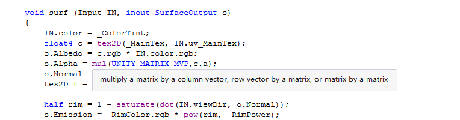
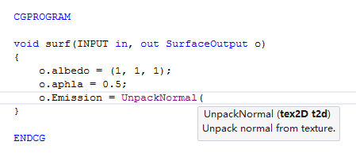
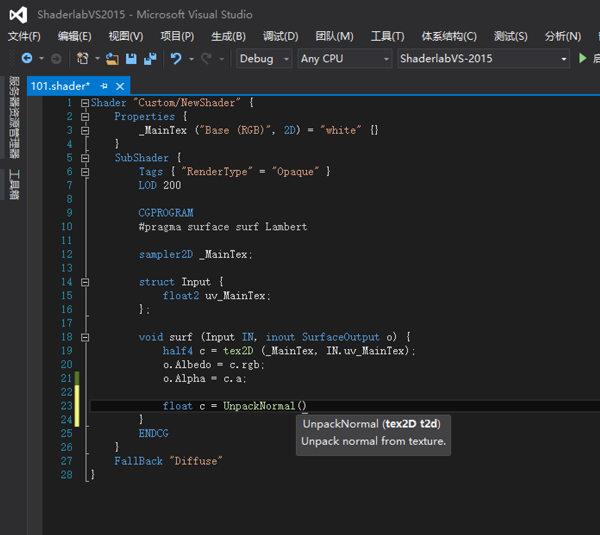
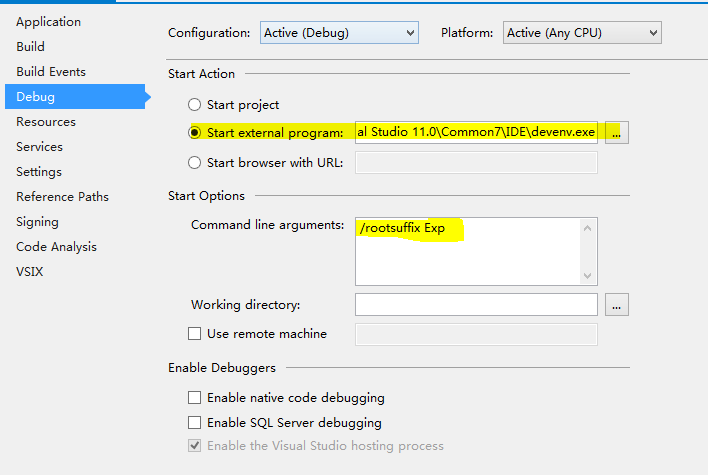

[中文版 README](https://github.com/wudixiaop/ShaderlabVS/blob/master/README_CN.md)

ShaderlabVS
===========

ShaderlabVS is a Visual Studio Plugin for Unity Shaderlab programming. Latest releae build can be found at [here](http://blog.shuiguzi.com/2014/10/28/Release/) or the Release page.

If you are looking for Shaderlab extensions for Visual Studio Code, you can take look at [ShaderlabVSCode(Free)](https://marketplace.visualstudio.com/items?itemName=amlovey.shaderlabvscodefree#review-details).

 

### Supports files:

* .shader
* .cginc
* .glslinc
* .compute
* .cg
* .hlsl

Features
-----

### Syntax Hightlighting and outlining

### Quickinfo

### Code Completion

### Signature help for CG and Unity built in functions

### Supports Dark Theme

Development
-----

### Requirements 

* Visual Studio
* Visual Studio SDK

### How to debug in Visual Studio
1. Download and install Visual Studio SDK
2. Open ShaderlabVS solution
3. Press *F6* to build solution
4. If you want to debug it in Visual Studio, and encounter problems, please make sure the **_Start exteral program_** and **_Comand line arguments_** in the **Debug** tab of ShaderlabVS project settings have value as follow:
    1. Set **_Start exteral program_** to the path of devenv.exe (the Visual studio main program)
    2. set **_Comand line arguments_** to **/rootsuffix Exp**. Below is a screenshot for the settings:

### Support Visual Studio Versions:
* Visual Studio 2013
* Visual Studio 2015
* Visual Studio 2017

__The other version are not tested, not sure if there are also work or not.__

### Thanks To

晨曦

### Buy me a coffe

If you like this extension, and want to buy me a coffee. You can via [Paypal](http://paypal.me/rockylai).
